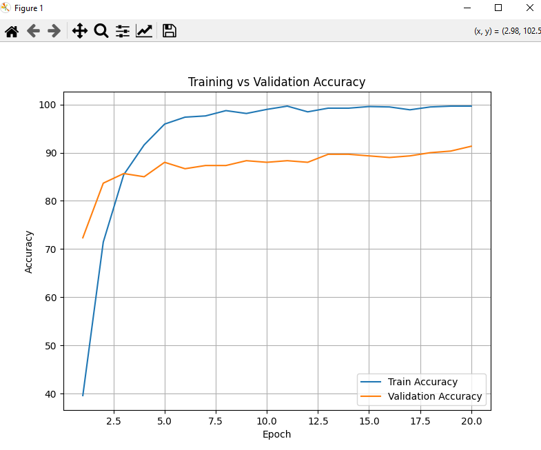

# Food_Detection-


📘 README (English):

🍽️ Food Classification Project

This project provides a desktop application for classifying food images using a deep learning model (ResNet50).
It integrates a PyQt6 graphical interface with a FastAPI backend, which serves the trained model for predictions.

🚀 Features

Upload an image of a meal from your computer.

Detect the type of food using a trained efficientnet_b0 model.

✅ Display:

Meal name

Confidence percentage

Estimated calories

Clean and modern UI with buttons (Choose Photo, Detect).

Separate result window showing the uploaded image and classification results.

📊Dataset:
The dataset used in this project is the Food-101 tiny, which contains 200 images for each  food category.
For this project, we selected 10 representative food classes to train and evaluate the model.
Source: Food-101 tiny Dataset on Kaggle


✅ Model Overview : 

Food Classifier using EfficientNet
This project implements a food image classifier using EfficientNet with several modern deep learning techniques to improve performance:

Backbone: EfficientNet-B0 (with optional use of timm for more flexible architectures).
Data Augmentation: Random resized crop, horizontal flip, rotation, and color jitter to increase robustness.
Optimizer: AdamW with weight decay for stable training.
Label Smoothing: Reduces overconfidence in predictions.
Mixed-Precision Training: Uses torch.cuda.amp to accelerate training on GPUs while saving memory.
Learning Rate Scheduler: Cosine annealing or ReduceLROnPlateau.
Balanced Sampling: Optionally uses weighted sampler to handle class imbalance.
Early Stopping: Stops training when validation accuracy does not improve for several epochs.
Evaluation Metrics: Accuracy and loss for both training and validation.
Deployment: FastAPI-based REST API for predicting food class, confidence, and estimated calories from images.
Number of classes: 10 (apple_pie, bibimbap, cannoli, chicken_curry, falafel, french_toast, ice_cream, ramen, sushi, tiramisu)

This model can be easily extended to more classes or different EfficientNet variants (B1-B7) if needed.

🛠️ Tech Stack :

Frontend (GUI): PyQt6
Backend (API): FastAPI + Uvicorn
Model: PyTorch (efficientnet_b0 fine-tuned on 10 food classes)
Image Processing: Torchvision, PIL

📂 Project Structure:


```bash
📂 Food_Project
├── api.py               # FastAPI backend (model + API endpoint)
├── main.py              # PyQt6 GUI (frontend)
├── chart/
│   └── pic.png
├── models/
│   ├── best_model_efficientnet_b0.pth
│   ├── final_efficientnet_b0.pth  # Trained model
│   └── train_log.csv
└── interfaces/
    └── food.png          # Background image for GUI

```

⚙️ Setup & Installation

Clone the repository:
git clone <repo-link>
cd Food_Project
Install dependencies:
pip install -r requirements.txt


🔹 Main requirements:
PyQt6
FastAPI
Uvicorn
Torch, Torchvision
Pillow
Requests

🚀 Run the API (backend):
python api.py
You should see:
Uvicorn running on http://127.0.0.1:8000
Run the GUI (frontend):
python main.py


📊 Classes & Calories:
The model supports 10 food classes (each class with 150 pictures) : 
apple_pie (300 kcal)
bibimbap (450 kcal)
cannoli (350 kcal)
chicken_curry (500 kcal)
falafel (350 kcal)
french_toast (400 kcal)
ice_cream (200 kcal)
ramen (550 kcal)
sushi (300 kcal)
tiramisu (450 kcal)


🖼️ Usage Flow:
Launch the app (main.py).
Select an image via Choose Photo.
Click Detect → the GUI sends the image to the API.
The API runs the model and returns: food class, confidence %, and calories.
"A Result Window pops up displaying the image and results."


🚀 Future Improvements : 
Expand Dataset:
     Add more food categories to cover a wider range of cuisines.
Nutritional Info:  
     Extend predictions to include protein, fat, carbs, etc., not just calories.
Mobile App Version: 
    Build an Android/iOS app for easier use.
Cloud Deployment: 
    Host the API on cloud services (Heroku, AWS, or Azure) so it works anywhere without running locally.
Offline Mode:
    Package the model inside the GUI to work without internet/API dependency.
User History:
    Save classification history for each user (with date/time).
Improved Accuracy: 
    Try other models (EfficientNet, Vision Transformers) or ensemble methods.
Multi-language Support:
     Add more languages to the GUI for wider usability.


_____________________________________________________________________--

📘 README (عربي):
🍽️ مشروع تصنيف الأطعمة:

هذا المشروع يقدم تطبيق سطح مكتب لتصنيف صور الأطعمة باستخدام نموذج تعلم عميق (ResNet50).
المشروع يدمج بين واجهة رسومية (PyQt6) و خادم خلفي (FastAPI) يعمل كوسيط بين الواجهة والموديل.


🚀 المزايا:

رفع صورة وجبة من جهاز المستخدم.
التعرف على نوع الطعام باستخدام نموذج efficientnet_b0 مدرّب مسبقًا.

✅ عرض:

اسم الوجبة
نسبة الثقة
السعرات الحرارية المتوقعة
واجهة رسومية حديثة مع أزرار (Choose Photo, Detect).
نافذة منفصلة لعرض النتيجة مع الصورة والبيانات.


📊 البيانات:
تم استخدام مجموعة بيانات   Food-101 tiny ، والتي تحتوي على 200 صورة لكل صنف من الـ 10 أصناف من الأطعمة 
في هذا المشروع، قمنا باختيار 10 أصناف فقط من هذه المجموعة لتدريب النموذج وتقييمه.
المصدر: Food-101 tiny على Kaggle


🛠️ بيئة العمل:
الواجهة الأمامية (GUI): PyQt6
الخلفية (API): FastAPI + Uvicorn
النموذج: PyTorch (ResNet50 مدرّب على 10 أصناف طعام) كل صنف 200 صوره.


📂 هيكل المشروع:
Food_Project/
│
├── api.py                 # كود الخادم (الموديل + API)
├── main.py  
# كود الواجهة الرسومية
├──chart/
     └──pic.png
├── models/
     └── best_model_efficientnet_b0.pth
     └── final_efficientnet_b0.pth       # النموذج المدرّب
│    └── train_log.csv     
├── interfaces/
│   └── food.png           # صورة الخلفية للواجهة

⚙️ خطوات التشغيل

تحميل المشروع:
git clone <repo-link>
cd Food_Project
تثبيت المكتبات المطلوبة:
pip install -r requirements.txt


🔹أهم المكتبات:

PyQt6

FastAPI

Uvicorn

Torch, Torchvision

Pillow

Requests


🚀تشغيل الخادم (API):

python api.py

سيظهر:
Uvicorn running on http://127.0.0.1:8000

python main.py


📊 الأصناف والسعرات الحرارية:

النموذج يدعم 10 أصناف طعام:
فطيرة التفاح (300 سعرة)
بيبيمباب (450 سعرة)
كانولي (350 سعرة)
كاري الدجاج (500 سعرة)
فلافل (350 سعرة)
فرنش توست (400 سعرة)
آيس كريم (200 سعرة)
رامن (550 سعرة)
سوشي (300 سعرة)
تيراميسو (450 سعرة)

🖼️ كيفية الاستخدام:

تشغيل الواجهة (main.py).

اختيار صورة باستخدام زر Choose Photo.

الضغط على Detect → الواجهة ترسل الصورة للـ API.

الخادم يعيد النتيجة: نوع الطعام + نسبة الثقة + السعرات.

نافذة جديدة تعرض الصورة والنتائج.


🚀 التطويرات المستقبلية :


توسيع قاعدة البيانات:
      إضافة المزيد من أصناف الأطعمة لتغطية مطابخ مختلفة.

معلومات غذائية شاملة:  
      عرض بيانات إضافية (البروتين، الدهون، الكربوهيدرات) بجانب السعرات.

إصدار للتطبيقات الذكية: 
      بناء نسخة مخصصة للأندرويد و iOS.

النشر على السحابة: 
      رفع الـ API على خوادم سحابية (Heroku, AWS, Azure) ليعمل من أي مكان بدون الحاجة للتشغيل المحلي.

وضع عدم الاتصال: 
      دمج النموذج مباشرة مع الواجهة ليعمل بدون إنترنت أو API خارجي.

حفظ السجل:
      تخزين تاريخ التصنيفات للمستخدم مع الوقت والتاريخ.

تحسين الدقة: 
     تجربة نماذج أخرى (EfficientNet, Vision Transformers) أو الجمع بين أكثر من نموذج.

دعم لغات متعددة:
     إضافة لغات مختلفة للواجهة لزيادة سهولة الاستخدام.


# Model Accuracy:

91.33 


# Chart about the differences between Training Accuracy vs Test Accuracy:



# Results:
No Overfitting .
A great Accuracy .


